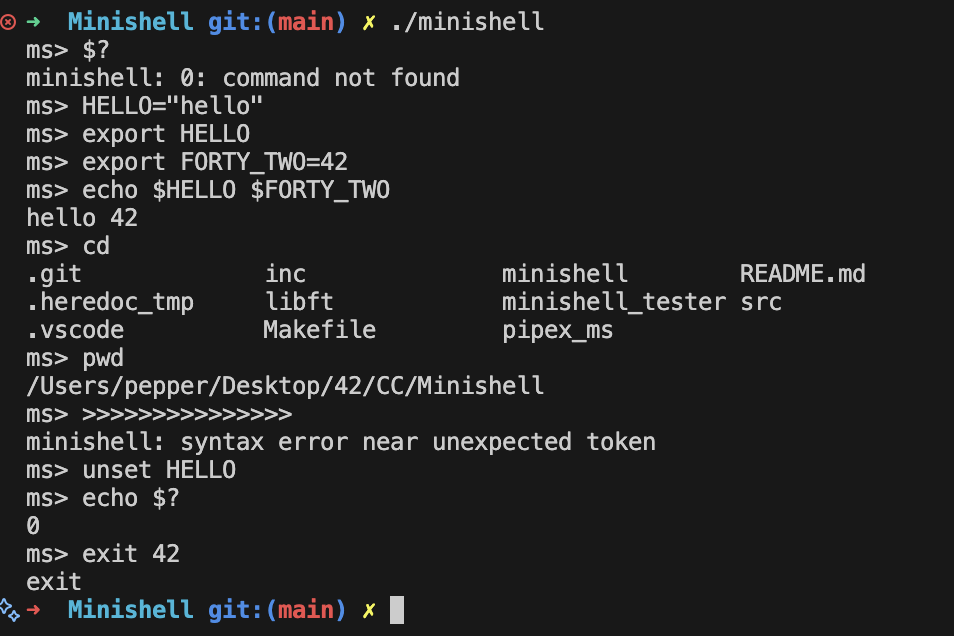
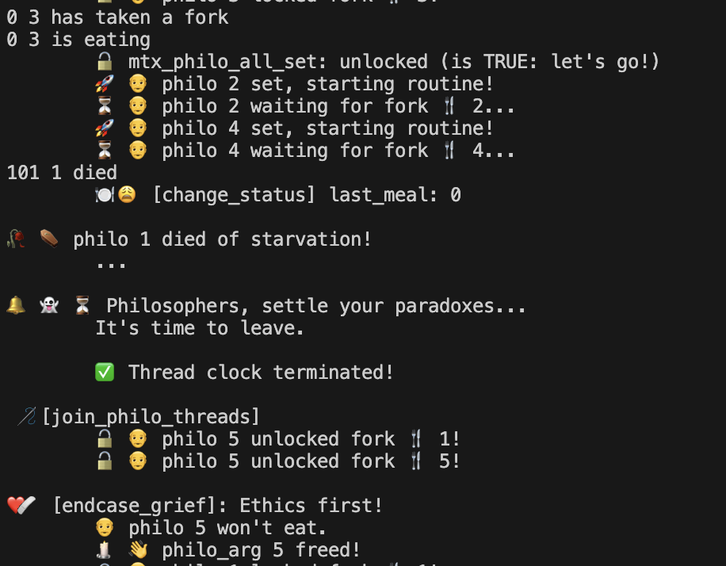

<details>
  <summary><strong>MY PROFILE</strong></summary>

  ```bash
int main()
{
  Profile my; // 🪪
  
  my.name = "Morgan";
  my.school = 42; /* Nice (France) */
  
  my.areasOfInterest = {
    "Software_Architecture" : "Designing scalable and efficient systems";
    "Web Development"       : "Javascript";
    "Game Development"      : "Unity, C#";
    "AI & Machine Learning" : "Natural language processing, cognitive science applications";
  };

  my.languages = { "English", "Русский", "Français", "汉语", "Esperanto" };
  my.assets = { "ambitious", "pragmatic", "adaptable" };
  my.currentTarget = "on 42 Common Core finish line";
  
  Background previousCarrier; // 📚
  
  previousCarrier.field = "Early education";
  previousCarrier.speciality = "Teaching French as a Foreign Language";
  previousCarrier.top[3] = { "Coordinator", "Trainer", "Director" };
  
  Company business; // 💼
  
  business._status = "IE"; /* Individual Entrepreneur */
  business._commercialName = "MARIDO";

  business._services = {
    "educational" : "private tutoring";
    "linguistic"  : "translation & localisation (en/ru/eo > fr); copyrighting"
    "informatics" : "undefined";
  };
  
  business._website = "https://www.marido.fr";

  Skills stack; // 🛠️

  stack.os[3] = { "Linux", "MacOS", "Windows" };
  stack.languages = { "C", "C++", "Javascript", "Python" };
  stack.frameworks = { "Typescript", "Tailwind CSS" };
  stack.ai_tools = { "GPT", "Claude", "Copilot", "Suno" };

   Misc facts[3] = { "hitchhiked around Europe for 3 years",
                     "lived 10 years in Russia",
                     "designed a bilingual preschool in the French Riviera" };

  if ( wantToKnowMore )
    sendMessage( "marido.entreprise[at]gmail.com" );
  else
    std::cout << "Thanks for reading, have a nice day!" << '\n';

  return ( $? );
}
```
</details>

<details>
  <summary><strong>MY LOGS</strong></summary>

<!-- WORKLOG:START -->

### 📅 2026-02-29

## Week of [09-02-2026 - 29-02-2026]

### [Workflow]
- Here we go! I lose so much time in France with nonsensical administrative tasks. It's like the whole social organization
aims to nothing else than keeping the statu quo, no matter how inefficient it is, and preventing people to actually *work* on what does matter. Anyway, there is a second load of absurd kafkaian procedures to tackle now, then I can go back
to something more fulfilling than bureaucrats' psychosis.

### [Transcendence_Team]
- Solved conversion issues with my Python script (thanks to [Derek's article: why is it so hard to pdf text extraction?](https://dev.to/derek-compdf/why-is-it-so-hard-to-pdf-text-extraction-k6h?utm_source=chatgpt.com).
- Learned to set a Django project. Intimidating at first, but it does not bite.
- Added 42 OAuth (and learned about 42 API)
- Added (for the most part) GDPR compliance on a dedicated page Documentation (contains legal documents and tools to see, download and delete data).
- Defined with the team what should be the next steps. Our goal is still to first finalize a minimal version, but we may add a couple of 'easy' modules. Can't wait to develop this project further.

### [42_Exam_Rank06]
- Tried and failed, but was close. Unexpectedly was able to register to a Tuesday's exam, will try not to fail harder. 

### [On_Pause_and_plans]
- Transcendence Solo: I will keep on doing it in the side to explore 'basic' stuff needed for any web app.
- Three other projects (V, T T, H).

### [Thoughts]
-  I read with great interest the article [Something Big is Happening (Matt Shumer)](https://shumer.dev/something-big-is-happening). Unsure on what to conclude though. IA is such a game-changer on many levels, and it evolves so fast that it is definitely not easy to decide on how to handle it. Its mere existence forces you to reconsider almost everything you were sure about.

[View all worklogs →](./worklogs)

<!-- WORKLOG:END -->

</details>

<details>
  <summary><strong>MY PROJECTS</strong></summary>

# ~ COMMON CORE ~

## Circle 0

| Project | Concise description | Main notions & concepts used |
|---|---|---|
| libft | Build your own reusable C utility library. | libc re-implementation, pointers, memory, Makefile, linked lists |

### Visual gallery
<p align="center">
  <a href="presentations/libft.md">
    
  </a>
  <a href="presentations/libft.md">
    
  </a>
</p>

---

## Circle 1

| Project | Concise description | Main notions & concepts used |
|---|---|---|
| ft_printf | Recreate `printf` (subset) with formatted output. | variadic args, parsing, formatting, write(), modular C design |
| get_next_line | Read a file descriptor line-by-line. | file I/O, buffers, static state, memory management |
| Born2beroot | Set up and harden a Linux VM like a (mini) sysadmin. | virtualization, Linux, users/groups, sudo, SSH, firewall, cron |

### Visual gallery
<p align="center">
  <a href="presentations/ft_printf.md">
    
  </a>
  <a href="presentations/get_next_line.md">
    
  </a>
  <a href="presentations/born2beroot.md">
    
  </a>
</p>

---

## Circle 2

| Project | Concise description | Main notions & concepts used |
|---|---|---|
| push_swap | Sort integers using two stacks and a limited instruction set. | sorting strategies, complexity, greedy/heuristics, data structures |
| minitalk | Send text between processes using UNIX signals. | signals, bitwise encoding, client/server |
| so_long | Build a tiny 2D game using MiniLibX. | event loop, rendering, map parsing, collision, flood fill |
| Exam Rank 02 | Timed C algorithmic exercises (multiple levels). | C basics, strings, pointers, small algorithms, speed/accuracy |

### Visual gallery
<p align="center">
  <a href="presentations/push_swap.md">
    
  </a>
  <a href="presentations/minitalk.md">
    
  </a>
  <a href="jack-pepper/so_long">
    
  </a>
</p>

---

## Circle 3

| Project | Concise description | Main notions & concepts used |
|---|---|---|
| minishell | Implement a minimal Bash-like shell. | parsing, env, fork/exec, pipes, redirections, signals, termios |
| Philosophers | Solve the Dining Philosophers concurrency problem. | threads, mutexes, deadlocks, timing, synchronization |
| Exam Rank 03 | Timed C exam. | C fundamentals, limited specs, debugging under pressure |

### Visual gallery
<p align="center">
  <a href="presentations/minishell.md">
    
  </a>
  <a href="presentations/philosophers.md">
    
  </a>
</p>

---

## Circle 4

| Project | Concise description | Main notions & concepts used |
|---|---|---|
| NetPractice | Solve networking exercises (IP/subnets/routing). | IPv4, subnetting, routing, masks, network reasoning |
| cub3D | Raycasting 3D maze (Wolf3D-style). | raycasting, textures, map parsing, rendering loop, math |
| CPP Module 00 | C++ basics & OOP intro. | classes, methods, namespaces, IO streams |
| CPP Module 01 | Memory & references in C++. | new/delete, references, pointers, RAII intro |
| CPP Module 02 | Ad-hoc polymorphism & orthodox canon form. | operator overload, canonical form, fixed-point-ish patterns |
| CPP Module 03 | Inheritance. | inheritance, protected/public, composition vs inheritance |
| CPP Module 04 | Subtype polymorphism & interfaces. | virtual, abstract classes, deep copy, polymorphism |
| Exam Rank 04 | Timed “micro-shell” style exam. | fork/exec, pipes, parsing argv, minimal shell behavior |

### Visual gallery
<p align="center">
  <a href="presentations/netpractice.md">
    
  </a>
  <a href="presentations/cub3d.md">
    
  </a>
  <a href="presentations/cpp_modules.md">
    
  </a>
</p>

---

## Circle 5

| Project | Concise description | Main notions & concepts used |
|---|---|---|
| Inception | Deploy a multi-service stack using Docker. | Docker, docker-compose, networks, volumes, Nginx, services |
| webserv | Write an HTTP server (HTTP/1.1). | sockets, HTTP, non-blocking I/O, config parsing, CGI |
| CPP Module 05 | Exceptions. | try/throw/catch, exception safety |
| CPP Module 06 | Casts. | static/dynamic/reinterpret/const cast, RTTI ideas |
| CPP Module 07 | Templates. | templates, generic programming |
| CPP Module 09 | Containers in practice. | containers, parsing, algorithms, composition |
| Exam Rank 05 | Timed C++ exam (multiple modules). | C++ syntax, OOP, problem solving, binary tree |

### Visual gallery
<p align="center">
  <a href="presentations/inception.md">
    
  </a>
  <a href="presentations/webserv.md">
    
  </a>
  <a href="presentations/cpp_advanced.md">
    
  </a>
</p>

---

## Circle 6

| Project | Concise description | Main notions & concepts used |
|---|---|---|
| ft_transcendence | Build a full-stack web app (multiplayer Pong). | web dev, auth, real-time (WebSockets), security, Docker, teamwork |
| Exam Rank 06 | Final timed "mini server" style exam. | advanced timed problem-solving, robustness, constraints |

### Visual gallery
<p align="center">
  <a href="presentations/ft_transcendence.md">
    
  </a>
  <a href="presentations/exam_rank_06.md">
    
  </a>
</p>

# Post Common Core
(To be unlocked)

</details>

  


`
