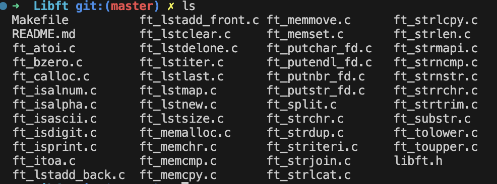
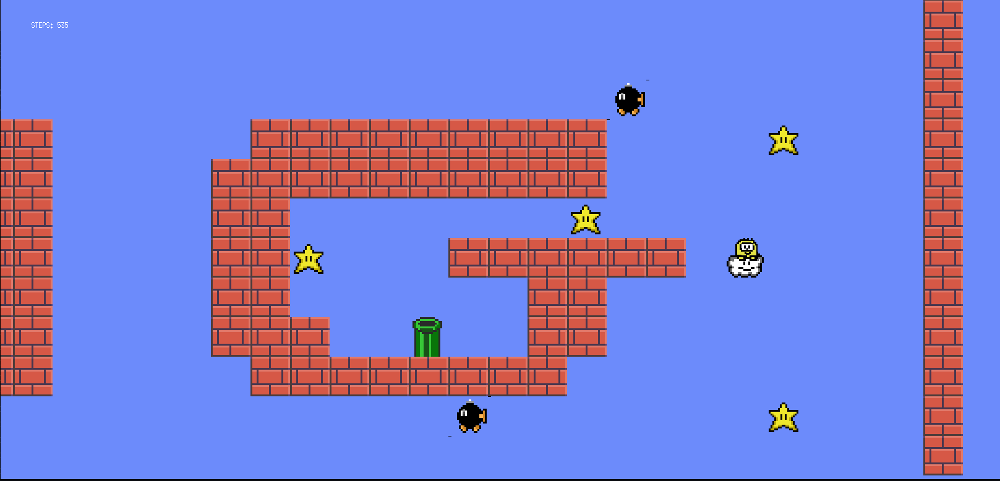
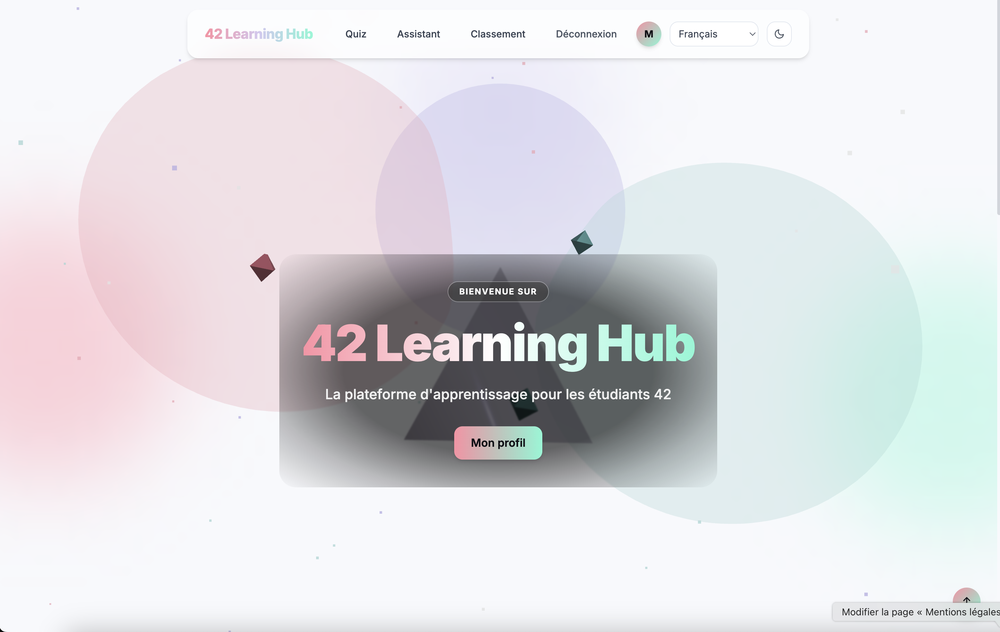
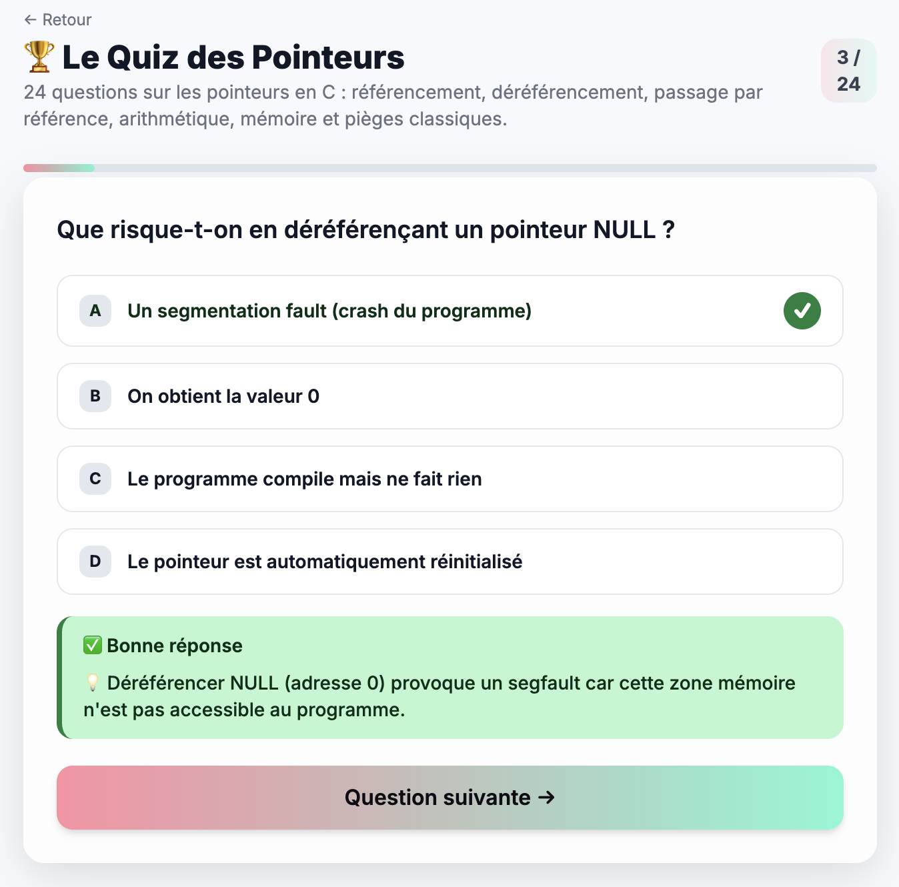
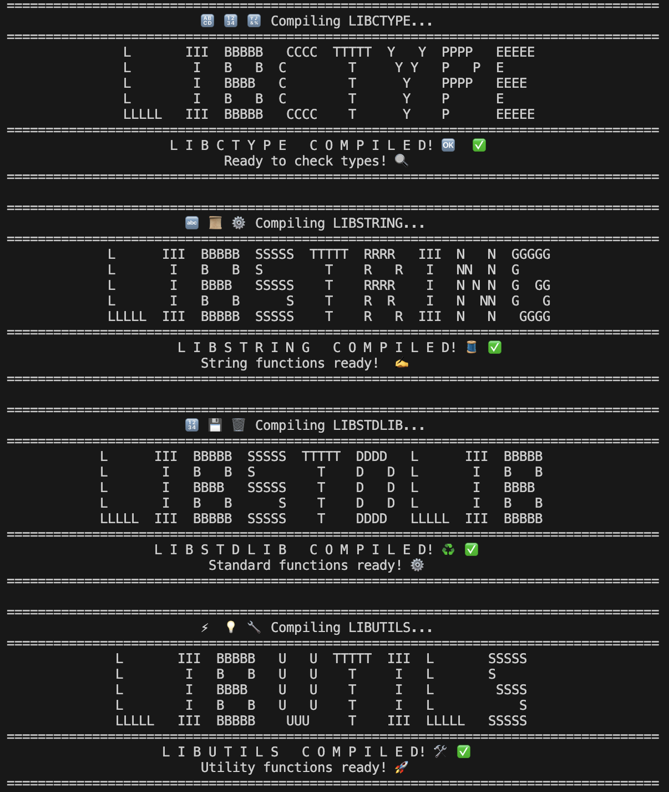
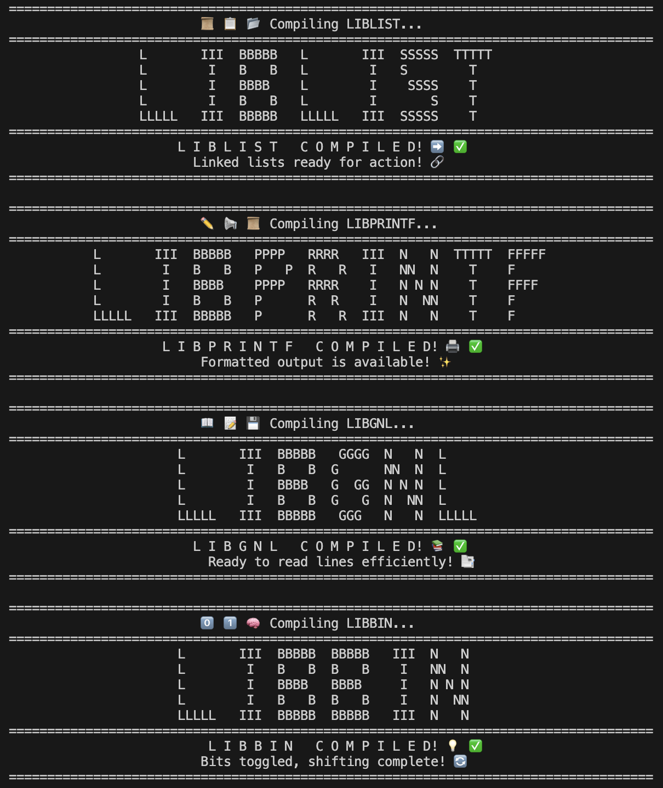
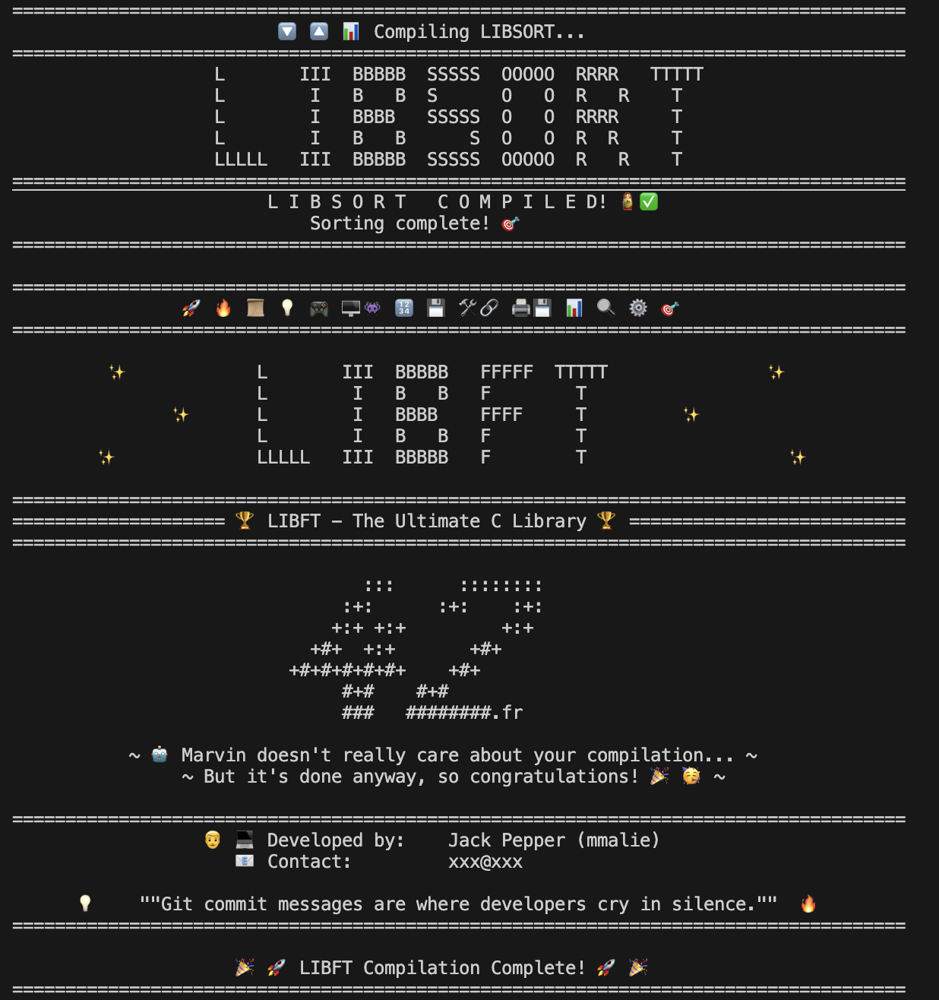

<details>
  <summary><strong>MY PROFILE</strong></summary>

  ```bash
int main()
{
  Profile my; // 🪪
  
  my.name = "Morgan";
  my.school = 42; /* Nice (France) */
  
  my.areasOfInterest = {
    "Software_Architecture" : "Designing scalable and efficient systems";
    "Web Development"       : "Javascript";
    "Game Development"      : "Unity, C#";
    "AI & Machine Learning" : "Natural language processing, cognitive science applications";
  };

  my.languages = { "English", "Русский", "Français", "汉语", "Esperanto" };
  my.assets = { "ambitious", "pragmatic", "adaptable" };
  my.currentTarget = "on 42 Common Core finish line";
  
  Background previousCarrier; // 📚
  
  previousCarrier.field = "Early education";
  previousCarrier.speciality = "Teaching French as a Foreign Language";
  previousCarrier.top[3] = { "Coordinator", "Trainer", "Director" };
  
  Company business; // 💼
  
  business._status = "IE"; /* Individual Entrepreneur */
  business._commercialName = "MARIDO";

  business._services = {
    "educational" : "private tutoring";
    "linguistic"  : "translation & localisation (en/ru/eo > fr); copyrighting"
    "informatics" : "undefined";
  };
  
  business._website = "https://www.marido.fr";

  Skills stack; // 🛠️

  stack.os[3] = { "Linux", "MacOS", "Windows" };
  stack.languages = { "C", "C++", "Javascript", "Python" };
  stack.frameworks = { "Typescript", "Tailwind CSS" };
  stack.ai_tools = { "GPT", "Claude", "Copilot", "Suno" };

   Misc facts[3] = { "hitchhiked around Europe for 3 years",
                     "lived 10 years in Russia",
                     "designed a bilingual preschool in the French Riviera" };

  if ( wantToKnowMore )
    sendMessage( "marido.entreprise[at]gmail.com" );
  else
    std::cout << "Thanks for reading, have a nice day!" << '\n';

  return ( $? );
}
```
</details>

<details>
  <summary><strong>MY LOGS</strong></summary>

<!-- WORKLOG:START -->

### Latest logs:

### [Workflow]
- Done: 42_Exam_Rank06 and Transcendence (42 Learning Hub). Validated 42 Common Core with max score and three 'oustanding' on the final project. Now moving to 42Advanced Cursus.
- Keeping this worklog updated was too challenging during the past weeks. But I'd like to come back to it, this is a good practice.

### [libasm]
- Goal: recode several classic C functions (strlen, strcpy, strcmp, write, read, strdup) using Assembly.
- I have been learning a lot thanks to [The Art of Assembly Language](https://www.ic.unicamp.br/~pannain/mc404/aulas/pdfs/Art%20Of%20Intel%20x86%20Assembly.pdf)
- Installed nasm and studied linkers.
- Implemented ft_strlen, ft_strcpy, ft_strcmp, ft_write, ft_read. Only left: ft_strdup.

### [42_Learning_Hub]
- Started the list of what should be done to launch the app in 42's clusters.

### [Herzen]
- During the last two months, I created an association, and gathered all the documents to register our school while finishing 42 CC.
- Now I will be working on an app that should save us a lot of time for school management.

[View all worklogs →](./worklogs)

<!-- WORKLOG:END -->

</details>

<details>
  <summary><strong>MY PROJECTS</strong></summary>

# ~ 42 COMMON CORE ~

## Circle 0

| Project | Concise description | Main notions & concepts used |
|---|---|---|
| libft | Build your own reusable C utility library. | libc re-implementation, pointers, memory, Makefile, linked lists |

### Visual gallery
<p align="center">
  <a href="presentations/libft.md">
    
  </a>
</p>

---

## Circle 1

| Project | Concise description | Main notions & concepts used |
|---|---|---|
| ft_printf | Recreate `printf` (subset) with formatted output. | variadic args, parsing, formatting, write(), modular C design |
| get_next_line | Read a file descriptor line-by-line. | file I/O, buffers, static state, memory management |
| Born2beroot | Set up and harden a Linux VM like a (mini) sysadmin. | virtualization, Linux, users/groups, sudo, SSH, firewall, cron |

### Visual gallery
<p align="center">
  <a href="presentations/ft_printf.md">
    
  </a>
  <a href="presentations/get_next_line.md">
    
  </a>
  <a href="presentations/born2beroot.md">
    
  </a>
</p>

---

## Circle 2

| Project | Concise description | Main notions & concepts used |
|---|---|---|
| push_swap | Sort integers using two stacks and a limited instruction set. | sorting strategies, complexity, greedy/heuristics, data structures |
| minitalk | Send text between processes using UNIX signals. | signals, bitwise encoding, client/server |
| so_long | Build a tiny 2D game using MiniLibX. | event loop, rendering, map parsing, collision, flood fill |
| Exam Rank 02 | Timed C algorithmic exercises (multiple levels). | C basics, strings, pointers, small algorithms, speed/accuracy |

### Visual gallery
<p align="center">
  <a href="presentations/push_swap.md">
    
  </a>
  <a href="presentations/minitalk.md">
    
  </a>
  <a href="https://github.com/jack-pepper/so_long">
    
  </a>
</p>

---

## Circle 3

| Project | Concise description | Main notions & concepts used |
|---|---|---|
| minishell | Implement a minimal Bash-like shell. | parsing, env, fork/exec, pipes, redirections, signals, termios |
| Philosophers | Solve the Dining Philosophers concurrency problem. | threads, mutexes, deadlocks, timing, synchronization |
| Exam Rank 03 | Timed C exam. | C fundamentals, limited specs, debugging under pressure |

### Visual gallery
<p align="center">
  <a href="presentations/minishell.md">
    
  </a>
  <a href="presentations/philosophers.md">
    
  </a>
</p>

---

## Circle 4

| Project | Concise description | Main notions & concepts used |
|---|---|---|
| NetPractice | Solve networking exercises (IP/subnets/routing). | IPv4, subnetting, routing, masks, network reasoning |
| cub3D | Raycasting 3D maze (Wolf3D-style). | raycasting, textures, map parsing, rendering loop, math |
| CPP Module 00 | C++ basics & OOP intro. | classes, methods, namespaces, IO streams |
| CPP Module 01 | Memory & references in C++. | new/delete, references, pointers, RAII intro |
| CPP Module 02 | Ad-hoc polymorphism & orthodox canon form. | operator overload, canonical form, fixed-point-ish patterns |
| CPP Module 03 | Inheritance. | inheritance, protected/public, composition vs inheritance |
| CPP Module 04 | Subtype polymorphism & interfaces. | virtual, abstract classes, deep copy, polymorphism |
| Exam Rank 04 | Timed “micro-shell” style exam. | fork/exec, pipes, parsing argv, minimal shell behavior |

### Visual gallery
<p align="center">
  <a href="presentations/netpractice.md">
    
  </a>
  <a href="presentations/cub3d.md">
    
  </a>
  <a href="presentations/cpp_modules.md">
    
  </a>
</p>

---

## Circle 5

| Project | Concise description | Main notions & concepts used |
|---|---|---|
| Inception | Deploy a multi-service stack using Docker. | Docker, docker-compose, networks, volumes, Nginx, services |
| webserv | Write an HTTP server (HTTP/1.1). | sockets, HTTP, non-blocking I/O, config parsing, CGI |
| CPP Module 05 | Exceptions. | try/throw/catch, exception safety |
| CPP Module 06 | Casts. | static/dynamic/reinterpret/const cast, RTTI ideas |
| CPP Module 07 | Templates. | templates, generic programming |
| CPP Module 09 | Containers in practice. | containers, parsing, algorithms, composition |
| Exam Rank 05 | Timed C++ exam (multiple modules). | C++ syntax, OOP, problem solving, binary tree |

### Visual gallery
<p align="center">
  <a href="presentations/inception.md">
    
  </a>
  <a href="presentations/webserv.md">
    
  </a>
  <a href="presentations/cpp_advanced.md">
    
  </a>
</p>

---

## Circle 6

| Project | Concise description | Main notions & concepts used |
|---|---|---|
| ft_transcendence | Build a full-stack web app (multiplayer Pong). | web dev, auth, real-time (WebSockets), security, Docker, teamwork |
| Exam Rank 06 | Final timed "mini server" style exam. | advanced timed problem-solving, robustness, constraints |

### Visual gallery
<p align="center">
  <a href="presentations/ft_transcendence.md">
    
  </a>
  <a href="presentations/ft_transcendence.md">
    
  </a>
  
  <a href="presentations/exam_rank_06.md">
    
  </a>
</p>

# Post Common Core

## Algo & AI & Data

## Security

## Devops

## Web & Mobile

## System & Kernel

| Project | Concise description | Main notions & concepts used |
|---|---|---|
| libasm | Become familiar with assembly language by implementing utilities. | (ongoing) |

## Graphics & Gaming

## Cryptography & Maths

## Development

## Professional experience

# Personal projects

## Around 42

| Project | Concise description | Main notions & concepts used |
|---|---|---|
| mylibft | Extend 42 libft C library project. | libc re-implementation, pointers, memory, Makefile, linked lists |

### Visual gallery
<p align="center">
  <a href="presentations/mylibft.md">
    
  </a>
  <a href="presentations/mylibft.md">
    
  </a>
  <a href="presentations/mylibft.md">
    
  </a>
</p>

</details>

  


`
